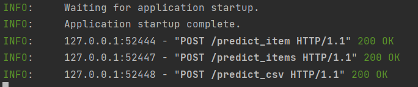
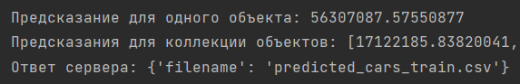

# Предсказание цен автомобилей с использованием моделей регрессии

## Описание

Этот проект решает задачу предсказания цены автомобилей на основе характеристик, таких как год выпуска, пробег, тип
топлива, тип продавца и другие параметры. Для этого используются модели регрессии, такие как **Lasso-регрессия**, **
ElasticNet** и **Ridge** с подбором гиперпараметров с помощью **GridSearchCV**.

## Что было сделано

1. **Предобработка данных:**
    - Категориальные признаки были преобразованы с помощью **OneHot-кодирования**.
    - Признаки, содержащие большое количество уникальных значений, были удалены.
    - Вещественные признаки были стандартизированы с помощью **StandardScaler**.

2. **Модели регрессии:**
    - Для решения задачи использованы модели:
        - **Lasso-регрессия** (Lasso Regression)
        - **ElasticNet-регрессия** (ElasticNet Regression)
        - **Ridge-регрессия** (Ridge Regression)
    - Оптимизация гиперпараметров с использованием **GridSearchCV**.

3. **Кастомная метрика:**
    - Разработана метрика, которая измеряет, насколько точно модель предсказывает цену с отклонением не более 10% от
      реальной цены.

4. **API-сервис на FastAPI:**
    - Разработан REST API, который позволяет:
        - Прогнозировать цену для одного объекта.
        - Прогнозировать цены для набора объектов.
        - Прогнозировать цены для набора объектов, переданного в формате CSV.

5. **Интерфейс API:**
    - **POST /predict_item**: принимает данные одного объекта и возвращает предсказанную цену.
    - **POST /predict_items**: принимает данные нескольких объектов и возвращает предсказанные цены для всех объектов.

### Выводы

- Все модели показывают схожие результаты, но **Lasso-регрессия** показала немного лучшие результаты по метрике R² и
  кастомной метрике.
- Оптимизация гиперпараметров через **GridSearchCV** улучшила точность моделей.
- Все модели дают прогнозы, отклоняющиеся на 10% от реальной цены, что соответствует бизнес-метрике.

## Как запустить проект

1. Установить зависимости:
    ```bash
    pip install -r requirements.txt
    ```

2. Запустить сервер:
    ```bash
    uvicorn app:app --reload
    ```

3. Перейти по адресу [http://127.0.0.1:8000/docs](http://127.0.0.1:8000/docs) для использования документации Swagger и
   тестирования API.

## Файлы в репозитории

- **`notebook.ipynb`** — Jupyter notebook с экспериментами.
- **`app.py`** — Python-файл с кодом FastAPI для обработки запросов.
- **`models.pickle`** — Сохраненная модель для предсказания.
- **`eda_report.html`** — Изображение дашборда.
- **`requirements.txt`** — Список зависимостей проекта.




